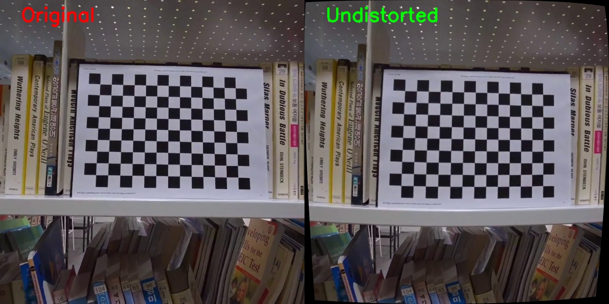
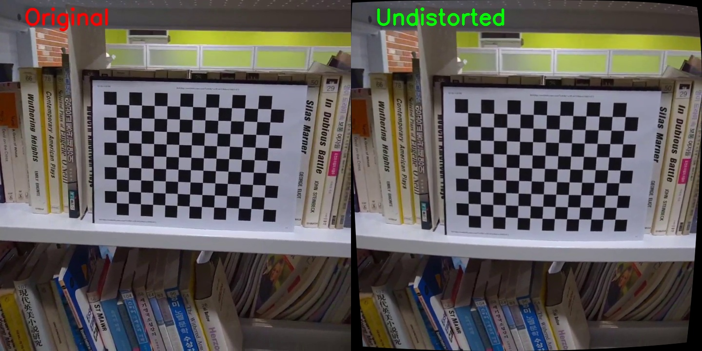
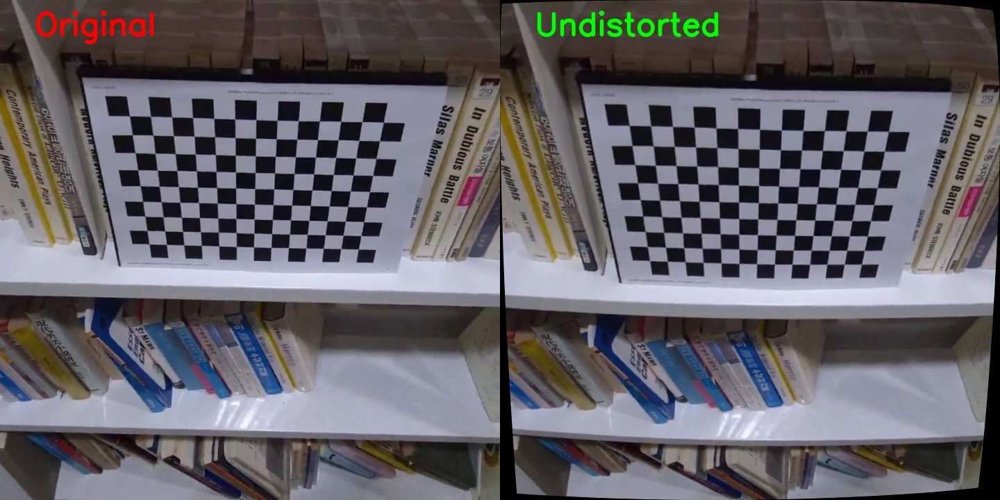

# Video Distortion Correction

Correct lens distortion in videos using OpenCV camera calibration. Record a chessboard pattern, calibrate your camera, and apply the correction to any video — all in two simple scripts.

## How It Works

1. **Calibrate** — `camera_calibration.py` extracts frames from a chessboard video, detects corner patterns, and computes the camera intrinsic matrix and distortion coefficients.
2. **Correct** — `correction.py` loads the calibration data and produces a side-by-side comparison video (original vs. undistorted), along with snapshot images.

## Demo

| | |
|---|---|
|  |  |
|  | |

> Side-by-side comparison: **Original** (left) vs. **Undistorted** (right)


## Usage

### Step 1: Camera Calibration

Record a video of a chessboard pattern from various angles and save it as `chessboard.mp4`, then run:

```bash
python camera_calibration.py
```

This will detect chessboard corners across frames and save the calibration result to `calibration_data.npz`.

### Step 2: Distortion Correction

```bash
python correction.py
```

This generates:
- `distortion_correction_demo.mp4` — side-by-side comparison video
- `comparison_snapshot_*.jpg` — snapshot images at 25%, 50%, and 75% of the video

## Project Structure

```
├── camera_calibration.py    # Calibration script (chessboard detection)
├── correction.py            # Distortion correction & demo generation
├── chessboard.mp4           # Sample calibration video
├── calibration_data.npz     # Saved calibration parameters
├── comparison_snapshot_*.jpg # Demo snapshot images
└── distortion_correction_demo.mp4
```

## Notes

- The calibration script auto-detects the chessboard dimensions by trying multiple board sizes.
- Frames are sampled every 15 frames to avoid redundant data.
- The `alpha=1` setting in `getOptimalNewCameraMatrix` preserves all pixels in the undistorted output.
